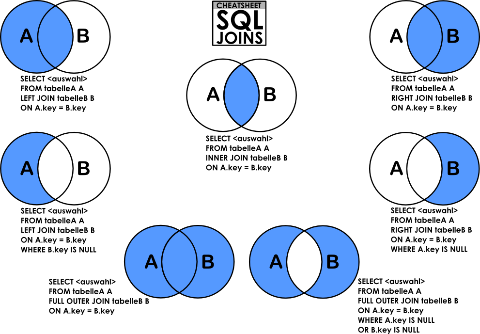

# 0x0E. SQL - More queries
## Resources
- [How To Create a New User and Grant Permissions in MySQL](https://www.digitalocean.com/community/tutorials/how-to-create-a-new-user-and-grant-permissions-in-mysql)
- [How To Use MySQL GRANT Statement To Grant Privileges To a User](https://www.mysqltutorial.org/mysql-administration/mysql-grant/)
- [MySQL constraints](https://zetcode.com/mysql/constraints/)
- [MySQL Cheat Sheet](https://intellipaat.com/mediaFiles/2019/02/SQL-Commands-Cheat-Sheet.pdf?US)
- [The Seven Types of SQL Joins](https://tableplus.com/blog/2018/09/a-beginners-guide-to-seven-types-of-sql-joins.html)
- [MySQL Tutorial](https://www.youtube.com/watch?v=yPu6qV5byu4&ab_channel=DerekBanas)
- [SQL Style Guide](https://www.sqlstyle.guide/)
- [MySQL 8.0 SQL Statement Syntax](https://dev.mysql.com/doc/refman/8.0/en/sql-statements.html)

Extra resources around relational database model design:
- [Design](https://www.guru99.com/database-design.html)
- [Normalization](https://www.guru99.com/database-normalization.html)
- [ER Modeling](https://www.guru99.com/er-modeling.html)

## Learning Objectives
<details>
<summary>How to create a new MySQL user</summary>

### Create a new MySQL user
#### 1. Creating a New MySQL User
1. Log in to MySQL: `mysql -u root -p`
2. Run the following SQL command: `CREATE USER 'username'@'localhost' IDENTIFIED BY 'my_password';`
- `localhost` specifies that the user can only connect from the local machine. To allow remote access, replace `'localhost'` with `'%'`.
- You can also set permissions for this user by running: `GRANT ALL PRIVILEGES ON *.* TO 'username'@'localhost' WITH GRANT OPTION;`
3. Apply Changes (important for certain MySQL versions): `FLUSH PRIVILEGES;`

#### 2. Deleting a MySQL User
1. Log in to MySQL (if you haven’t already): `mysql -u root -p`
2. Delete the User: `DROP USER 'username'@'localhost';`
3. Apply Changes: `FLUSH PRIVILEGES;`
</details>
<details>
<summary>How to manage privileges for a user to a database or table</summary>

### Manage Privileges
To manage privileges for a MySQL user, you use the `GRANT` and `REVOKE` commands to give or take away permissions.

#### Grant Privileges
1. Log in to MySQL: `mysql -u root -p`
2. Grant Privileges:

| Privilege Type                              | Command                                                                                     | Example                                                                                      |
|---------------------------------------------|---------------------------------------------------------------------------------------------|----------------------------------------------------------------------------------------------|
| **Grant All Privileges on a Database**      | `GRANT ALL PRIVILEGES ON database_name.* TO 'username'@'host';`                             | `GRANT ALL PRIVILEGES ON employees.* TO 'john'@'localhost';`                                 |
| **Grant Specific Privileges on a Database** | `GRANT privilege1, privilege2 ON database_name.* TO 'username'@'host';`                     | `GRANT SELECT, INSERT ON employees.* TO 'john'@'localhost';`                                 |
| **Grant Privileges on a Specific Table**    | `GRANT privilege1, privilege2 ON database_name.table_name TO 'username'@'host';`            | `GRANT SELECT, UPDATE ON employees.salary TO 'john'@'localhost';`                            |
| **Grant Privileges for Remote Access**      | `GRANT ALL PRIVILEGES ON database_name.* TO 'username'@'%';`                                | `GRANT ALL PRIVILEGES ON employees.* TO 'john'@'%';`                                         |
| **Grant Privileges with Specific Host**     | `GRANT ALL PRIVILEGES ON database_name.* TO 'username'@'specific_ip_address';`              | `GRANT ALL PRIVILEGES ON employees.* TO 'john'@'192.168.1.10';`                              |
| **Grant Only SELECT Privilege on Database** | `GRANT SELECT ON database_name.* TO 'username'@'host';`                                     | `GRANT SELECT ON employees.* TO 'john'@'localhost';`                                         |
| **Grant Privileges on Multiple Tables**     | `GRANT privilege1 ON database_name.table1, database_name.table2 TO 'username'@'host';`      | `GRANT SELECT ON employees.salary, employees.department TO 'john'@'localhost';`              |

3. Apply Changes: `FLUSH PRIVILEGES;`

#### Revoke Privileges
Revoke Privileges on a Database:

| Action                                     | Command                                                                                 | Example                                                                                   |
|--------------------------------------------|-----------------------------------------------------------------------------------------|-------------------------------------------------------------------------------------------|
| **Revoke All Privileges on a Database**    | `REVOKE ALL PRIVILEGES ON database_name.* FROM 'username'@'host';`                       | `REVOKE ALL PRIVILEGES ON employees.* FROM 'john'@'localhost';`                           |
| **Revoke Specific Privileges on a Database** | `REVOKE privilege1, privilege2 ON database_name.* FROM 'username'@'host';`             | `REVOKE SELECT, INSERT ON employees.* FROM 'john'@'localhost';`                           |
| **Revoke Privileges on a Specific Table**  | `REVOKE privilege1, privilege2 ON database_name.table_name FROM 'username'@'host';`      | `REVOKE SELECT, UPDATE ON employees.salary FROM 'john'@'localhost';`                      |
| **Revoke Remote Access Privileges**        | `REVOKE ALL PRIVILEGES ON database_name.* FROM 'username'@'%';`                          | `REVOKE ALL PRIVILEGES ON employees.* FROM 'john'@'%';`                                   |
| **Revoke Privileges from Specific IP**     | `REVOKE ALL PRIVILEGES ON database_name.* FROM 'username'@'specific_ip_address';`        | `REVOKE ALL PRIVILEGES ON employees.* FROM 'john'@'192.168.1.10';`                        |
| **Revoke Only SELECT Privilege on Database** | `REVOKE SELECT ON database_name.* FROM 'username'@'host';`                               | `REVOKE SELECT ON employees.* FROM 'john'@'localhost';`                                   |

2. Apply Changes: `FLUSH PRIVILEGES;`

#### Checking User Privileges
To see what privileges a user currently has, you can run:
```sql
SHOW GRANTS FOR 'username'@'localhost';
```
</details>
<details>
<summary>What’s a PRIMARY KEY</summary>

### PRIMARY KEY
In MySQL, a PRIMARY KEY is a unique identifier for each row in a table. It is a column (or a set of columns) that uniquely identifies each record, ensuring that no two rows can have the same primary key value. The primary key has the following properties:
- **Uniqueness:** No duplicate values are allowed in a primary key column.
- **Not Null:** A primary key cannot contain NULL values; every row must have a unique, non-null value for the primary key.
- **Single Row Identification:** Each primary key value points to a single row, enabling fast data retrieval.

#### How to Define a PRIMARY KEY
You can define a primary key when creating a table:

```sql
CREATE TABLE employees (
    employee_id INT NOT NULL,
    first_name VARCHAR(50),
    last_name VARCHAR(50),
    PRIMARY KEY (employee_id)
);
```
Or you can add a primary key constraint to an existing table:

```sql
ALTER TABLE employees
ADD PRIMARY KEY (employee_id);
```
#### Composite Primary Key
A primary key can also be composed of multiple columns, known as a composite primary key:
```sql
CREATE TABLE orders (
    order_id INT,
    product_id INT,
    PRIMARY KEY (order_id, product_id)
);
```
In this example, the combination of `order_id` and `product_id` must be unique, enforcing a unique identifier for each product in each order.
</details>
<details>
<summary>What’s a FOREIGN KEY</summary>

### FOREIGN KEY
In MySQL, a FOREIGN KEY is a constraint used to link two tables together. It enforces a relationship between a column in one table (the child table) and a column in another table (the parent table), typically the PRIMARY KEY in the parent table. Foreign keys help maintain referential integrity in the database, ensuring that relationships between tables remain consistent.

#### Properties of a Foreign Key
- **Consistency:** It ensures that values in the foreign key column(s) match values in the referenced column(s) or are NULL.
- **Cascading Effects:** Foreign keys can trigger actions (like `ON DELETE CASCADE` or `ON UPDATE CASCADE`) when related data in the parent table changes, helping manage data dependencies automatically.
- **Referential Integrity:** By linking tables, foreign keys ensure that a row in one table corresponds to an existing row in the other table, preserving data accuracy.

#### How to Define a FOREIGN KEY
Here’s an example where we link an `orders` table with a `customers` table, using the `customer_id` column as the foreign key.

```sql
CREATE TABLE customers (
    customer_id INT PRIMARY KEY,
    customer_name VARCHAR(100)
);

CREATE TABLE orders (
    order_id INT PRIMARY KEY,
    order_date DATE,
    customer_id INT,
    FOREIGN KEY (customer_id) REFERENCES customers(customer_id)
);
```
#### Foreign Key with Cascade Options
You can specify what should happen to child rows if the parent row is deleted or updated. For instance:
- **ON DELETE CASCADE:** When a row in the parent table is deleted, all corresponding rows in the child table are deleted.
- **ON UPDATE CASCADE:** When the primary key in the parent table is updated, the foreign key in the child table is updated to match.

Example:
```sql
CREATE TABLE orders (
    order_id INT PRIMARY KEY,
    order_date DATE,
    customer_id INT,
    FOREIGN KEY (customer_id) REFERENCES customers(customer_id)
    ON DELETE CASCADE
    ON UPDATE CASCADE
);
```
In this example, deleting a customer will also delete all their associated orders. Similarly, updating a `customer_id` will update the corresponding `customer_id` in the `orders` table.
</details>
<details>
<summary>How to use NOT NULL, UNIQUE and other constraints</summary>

### Constraints
Constraints in MySQL are rules that enforce data integrity and define specific conditions on table columns. They help ensure that the data stored in the database is accurate, reliable, and consistent.

#### 1. PRIMARY KEY Constraint
The PRIMARY KEY constraint uniquely identifies each record in a table. A table can only have one primary key, which can consist of one or multiple columns (composite primary key).

**Properties:**
- A primary key column cannot have NULL values.
- It must contain unique values.

Example:
```sql
CREATE TABLE employees (
    employee_id INT PRIMARY KEY,
    first_name VARCHAR(50),
    last_name VARCHAR(50)
);
```
In this example, `employee_id` is the primary key, uniquely identifying each employee.

#### 2. FOREIGN KEY Constraint
The FOREIGN KEY constraint creates a link between two tables, enforcing a relationship. A foreign key in one table points to a primary key in another table.

**Properties:**
- Helps maintain referential integrity.
- Can define cascading operations (e.g., ON `DELETE CASCADE`).

Example:
```sql
CREATE TABLE departments (
    department_id INT PRIMARY KEY,
    department_name VARCHAR(50)
);

CREATE TABLE employees (
    employee_id INT PRIMARY KEY,
    department_id INT,
    FOREIGN KEY (department_id) REFERENCES departments(department_id)
    ON DELETE CASCADE
);
```
In this case, deleting a department will delete all associated employees due to the `ON DELETE CASCADE` option.

#### 3. UNIQUE Constraint
The UNIQUE constraint ensures that all values in a column are distinct. Unlike the primary key, a table can have multiple unique constraints, and a unique column can have one NULL value.

**Properties:**
- Enforces uniqueness for a column's values.
- Allows one NULL entry if the column is nullable.

Example:
```sql
CREATE TABLE products (
    product_id INT PRIMARY KEY,
    product_name VARCHAR(100) UNIQUE
);
```
Here, `product_name` must be unique across the products table.

#### 4. NOT NULL Constraint
The NOT NULL constraint enforces that a column cannot contain NULL values, ensuring that each row has meaningful data in that column.

**Properties:**
- Prevents columns from having NULL values.

Example:
```sql
CREATE TABLE users (
    user_id INT PRIMARY KEY,
    username VARCHAR(50) NOT NULL,
    email VARCHAR(100) NOT NULL
);
```
In this example, `username` and `email` cannot be NULL, requiring a value in every row.

#### 5. CHECK Constraint
The CHECK constraint limits the values that can be inserted into a column based on a specified condition. MySQL began supporting `CHECK` constraints with version 8.0.16.

**Properties:**
- Enforces a condition on data values.
- Ensures that data meets specific criteria.

Example:
```sql
CREATE TABLE employees (
    employee_id INT PRIMARY KEY,
    age INT CHECK (age >= 18),
    salary DECIMAL(10, 2) CHECK (salary > 0)
);
```
Here, `age` must be at least 18, and `salary` must be positive.

#### 6. DEFAULT Constraint
The DEFAULT constraint provides a default value for a column if no value is specified during an `INSERT` operation.

**Properties:**
- Assigns default values to a column.
- Simplifies inserting rows by providing automatic values.

Example:
```sql
CREATE TABLE orders (
    order_id INT PRIMARY KEY,
    order_date DATE DEFAULT CURRENT_DATE,
    status VARCHAR(20) DEFAULT 'pending'
);
```
In this table, if no value is provided for `order_date` or `status`, MySQL will use the default values (`CURRENT_DATE` and `'pending'`).

#### 7. AUTO_INCREMENT Constraint
The AUTO_INCREMENT constraint is used with integer columns to automatically generate unique numbers for each new row. This is commonly used for primary keys.

**Properties:**
- Automatically assigns incrementing values to new rows.
- Commonly used with primary keys for unique row identification.

Example:
```sql
CREATE TABLE orders (
    order_id INT AUTO_INCREMENT PRIMARY KEY,
    customer_name VARCHAR(100)
);
```
Here, `order_id` automatically increases with each new record, ensuring each row has a unique ID.

| Constraint         | Description                                                                                 | Example Usage                                                      |
|--------------------|---------------------------------------------------------------------------------------------|--------------------------------------------------------------------|
| **PRIMARY KEY**    | Uniquely identifies each record; does not allow NULLs.                                      | `employee_id INT PRIMARY KEY`                                      |
| **FOREIGN KEY**    | Enforces a link between two tables, maintaining referential integrity.                      | `FOREIGN KEY (department_id) REFERENCES departments(department_id)`|
| **UNIQUE**         | Ensures all values in a column are distinct; allows one NULL in nullable columns.           | `email VARCHAR(100) UNIQUE`                                        |
| **NOT NULL**       | Ensures a column cannot have NULL values.                                                   | `username VARCHAR(50) NOT NULL`                                    |
| **CHECK**          | Restricts the range of values for a column based on a condition.                            | `age INT CHECK (age >= 18)`                                        |
| **DEFAULT**        | Assigns a default value to a column if none is provided.                                    | `status VARCHAR(20) DEFAULT 'pending'`                             |
| **AUTO_INCREMENT** | Automatically increments column values, typically used for primary keys.                    | `order_id INT AUTO_INCREMENT PRIMARY KEY`                          |

</details>
<details>
<summary>How to retrieve datas from multiple tables in one request</summary>

### JOIN operations
To retrieve data from multiple tables in a single request in MySQL, you typically use JOIN operations. There are different types of JOINs, depending on how you want to match rows from the tables.

#### Types of Joins
- **INNER JOIN:** Returns rows when there is a match in both tables.
- **LEFT JOIN (or LEFT OUTER JOIN):** Returns all rows from the left table, and matching rows from the right table. If there is no match, NULL values are returned for columns from the right table.
- **RIGHT JOIN (or RIGHT OUTER JOIN):** Returns all rows from the right table, and matching rows from the left table. If there is no match, NULL values are returned for columns from the left table.
- **FULL OUTER JOIN:** Returns all rows when there is a match in either left or right table. This is not directly supported in MySQL, but can be simulated using UNION.
- **CROSS JOIN:** Returns the Cartesian product of the two tables, i.e., every row from the first table is joined with every row from the second table.

#### Syntax for Retrieving Data from Multiple Tables
##### Example using `INNER JOIN`:
```sql
SELECT employees.name, departments.department_name
FROM employees
INNER JOIN departments ON employees.department_id = departments.department_id;
```
This query retrieves the names of employees along with their department names where there is a match on `department_id` between the `employees` and `departments` tables.

##### Example using `LEFT JOIN`:
```sql
SELECT employees.name, departments.department_name
FROM employees
LEFT JOIN departments ON employees.department_id = departments.department_id;
```
This query retrieves the names of all employees along with their department names. If an employee does not belong to a department, `department_name` will be `NULL`.

##### Example using `RIGHT JOIN`:
```sql
SELECT employees.name, departments.department_name
FROM employees
RIGHT JOIN departments ON employees.department_id = departments.department_id;
```
This query retrieves the names of all departments along with the employee names. If no employee belongs to a department, `name` will be `NULL`.

##### Example using `FULL OUTER JOIN` (simulated):
```sql
SELECT employees.name, departments.department_name
FROM employees
LEFT JOIN departments ON employees.department_id = departments.department_id
UNION
SELECT employees.name, departments.department_name
FROM employees
RIGHT JOIN departments ON employees.department_id = departments.department_id;
```
This query retrieves all employees and all departments. If an employee is not assigned to a department, their department name will be `NULL`, and if a department has no employees, the employee name will be NULL.

##### Example using `CROSS JOIN`:
```sql
SELECT employees.name, departments.department_name
FROM employees
CROSS JOIN departments;
```
This query returns the Cartesian product of `employees` and `departments`, meaning it will combine every employee with every department.

#### Conclusion:
- Use `INNER JOIN` to get only matching rows.
- Use `LEFT JOIN` or `RIGHT JOIN` if you want to retrieve all records from one table and matched records from the other table.
- `CROSS JOIN` is useful when you need the Cartesian product of two tables.

By choosing the appropriate join type, you can retrieve and combine data from multiple tables efficiently in a single query.
</details>
<details>
<summary>What are subqueries</summary>

### Subqueries
A subquery (or inner query) is a query that is nested inside another query, typically within a `SELECT`, `INSERT`, `UPDATE`, or `DELETE` statement. It allows you to perform a query on the result of another query. Subqueries can return a single value, a list of values, or a set of rows, depending on how they are used.

#### Types of Subqueries
- **Single-Row Subquery:** Returns a single row and a single column.
- **Multiple-Row Subquery:** Returns multiple rows, usually used with operators like `IN` or `ANY`.
- **Multiple-Column Subquery:** Returns multiple rows and multiple columns.
- **Correlated Subquery:** Refers to columns from the outer query, and is executed once for each row processed by the outer query.
- **Non-Correlated Subquery:** Independent of the outer query, and can be executed independently.

#### Syntax for Subqueries
A subquery is usually written inside parentheses `()` and is used in the `WHERE`, `FROM`, or `SELECT` clauses.

#### Where Can You Use a Subquery?
- **In the `WHERE` Clause:** To filter results based on values returned by another query.
- **In the `FROM` Clause:** To treat the result of a subquery as a table.
- **In the `SELECT` Clause:** To compute a derived value that can be used in the main query.
- **In the `HAVING` Clause:** To filter groups after the aggregation.

#### 1. Subquery in the `WHERE` Clause:
To find employees whose salary is greater than the average salary:

```sql
SELECT name, salary
FROM employees
WHERE salary > (SELECT AVG(salary) FROM employees);
```
Here, the subquery `(SELECT AVG(salary) FROM employees)` calculates the average salary, and the outer query selects employees with salaries greater than that value.

#### 2. Subquery with `IN` (Multiple-Row Subquery):
Find employees who work in the same departments as "John Doe":

```sql
SELECT name
FROM employees
WHERE department_id IN (SELECT department_id FROM employees WHERE name = 'John Doe');
```
This subquery returns a list of `department_ids` for employees named 'John Doe', and the outer query selects all employees who work in those departments.

#### 3. Subquery in the `FROM` Clause:
Treat the result of a subquery as a table:

```sql
SELECT department_id, AVG(salary)
FROM (SELECT department_id, salary FROM employees WHERE salary > 50000) AS high_salary_employees
GROUP BY department_id;
```
Here, the subquery `(SELECT department_id, salary FROM employees WHERE salary > 50000)` retrieves employees with salaries above 50,000, and the outer query calculates the average salary for each department.

#### 4. Correlated Subquery:
A correlated subquery references columns from the outer query. It is executed for each row processed by the outer query.

```sql
SELECT e1.name, e1.salary
FROM employees e1
WHERE e1.salary > (SELECT AVG(e2.salary) FROM employees e2 WHERE e1.department_id = e2.department_id);
```
In this example, the subquery calculates the average salary for the department of each employee `e1`. The outer query selects employees who earn more than the average salary in their respective departments.

#### 5. Subquery in the `HAVING` Clause:
To find departments where the average salary is greater than the average salary across all departments:

```sql
SELECT department_id, AVG(salary)
FROM employees
GROUP BY department_id
HAVING AVG(salary) > (SELECT AVG(salary) FROM employees);
```
This query groups employees by department and calculates the average salary for each department, filtering out departments where the average salary is less than the overall average salary.

#### Advantages of Using Subqueries
- **Simplicity:** Subqueries allow complex queries to be broken down into simpler, more manageable parts.
- **Flexibility:** Subqueries can be used to perform various types of comparisons or aggregations.
- **Encapsulation:** They enable one query to be embedded inside another, which allows for cleaner and more readable queries.
#### Disadvantages of Using Subqueries
- **Performance:** In some cases, subqueries can be less efficient than joins, especially if they are correlated. This is because the subquery may be executed multiple times (once for each row of the outer query).
- **Complexity:** Subqueries can make queries harder to read and debug, especially when nested deeply.
#### Conclusion
Subqueries are powerful tools in SQL that allow you to retrieve data based on the results of another query. They are used to perform comparisons, aggregations, and transformations in various parts of a query, making your SQL queries more flexible and expressive. However, it’s important to consider the performance implications, especially with correlated subqueries, and choose the right approach for your use case.

</details>
<details>
<summary>What is UNION</summary>

### UNION
The `UNION` operator in SQL is used to combine the result sets of two or more `SELECT` statements into a single result set. The combined result set will include all the rows from both queries but will remove duplicate rows by default.

#### Key Points about `UNION`:
- **Combines results:** It combines the results of two or more `SELECT` statements into one.
- **No duplicates:** `UNION` removes duplicate rows automatically.
- **Same number of columns:** The number of columns and their data types in the result sets of the queries being combined must be the same.
- **Order of columns matters:** The order of columns in each `SELECT` statement must match.
- **Performance:** If you need to include duplicates, you can use `UNION ALL` for better performance, as it does not remove duplicates.
#### Syntax for `UNION`
```sql
SELECT column1, column2, ...
FROM table1
WHERE condition
UNION
SELECT column1, column2, ...
FROM table2
WHERE condition;
```
#### Key Considerations:
- **Column Count:** The number of columns in each `SELECT` must be the same.
- **Data Types:** The corresponding columns must have compatible data types.
- **Order of Columns:** The order of columns in both `SELECT` statements must be the same.
#### Example of Using `UNION`
Let's say you have two tables: `employees` and `contractors`, and both have the columns `name` and `position`. You want to get a combined list of all employees and contractors.

```sql
SELECT name, position FROM employees
UNION
SELECT name, position FROM contractors;
```
This query returns a list of unique names and positions from both the employees and contractors tables.

#### Example with Different Data Types (but compatible)
Let's assume you have two tables: `students` and `teachers`, and both have columns `name` and `email`.

```sql
SELECT name, email FROM students
UNION
SELECT name, email FROM teachers;
```
In this case, the `name` and `email` columns are of compatible data types, so you can use `UNION` to combine the results.

#### Using `UNION ALL`
If you want to include all rows, even the duplicates, you can use `UNION ALL` instead of `UNION`. This can improve performance, as it does not check for duplicates.

```sql
SELECT name, position FROM employees
UNION ALL
SELECT name, position FROM contractors;
```
#### Example with `ORDER BY`
You can also use `ORDER BY` to sort the combined result set. However, the `ORDER BY` clause should be used only once, and it must come after all the `SELECT` statements.

```sql
SELECT name, position FROM employees
UNION
SELECT name, position FROM contractors
ORDER BY name;
```
This will return the combined list of names and positions sorted alphabetically by `name`.

#### Differences between `UNION` and `JOIN`
- `UNION`: Combines rows from multiple `SELECT` queries into one result set.
- `JOIN`: Combines columns from two or more tables based on a related column.
#### Example of `JOIN` vs `UNION`
If you have two tables, `students` and `courses`, and you want to list each student with the courses they are enrolled in, you would use a `JOIN`:

```sql
SELECT students.name, courses.course_name
FROM students
JOIN courses ON students.student_id = courses.student_id;
```
Whereas if you wanted to combine the results from `students` and `teachers` into one result set (with `name` and `position`), you'd use `UNION`:

```sql
SELECT name, position FROM students
UNION
SELECT name, position FROM teachers;
```
#### Conclusion
The `UNION` operator in SQL is a powerful tool for combining the results of multiple `SELECT` statements. It ensures that the combined result set does not contain duplicates, and it requires that the queries being combined have the same number of columns with compatible data types. If you need to keep all rows, including duplicates, use `UNION ALL`.
</details>

## More Info
### Comments for your SQL file:
```bash
$ cat my_script.sql
-- 3 first students in the Batch ID=3
-- because Batch 3 is the best!
SELECT id, name FROM students WHERE batch_id = 3 ORDER BY created_at DESC LIMIT 3;
```
### Install MySQL 8.0 on Ubuntu 20.04 LTS
```bash
$ sudo apt update
$ sudo apt install mysql-server
...
$ mysql --version
mysql  Ver 8.0.25-0ubuntu0.20.04.1 for Linux on x86_64 ((Ubuntu))
```
Connect to your MySQL server:
```bash
$ sudo mysql
Welcome to the MySQL monitor.  Commands end with ; or \g.
Your MySQL connection id is 11
Server version: 8.0.25-0ubuntu0.20.04.1 (Ubuntu)

Copyright (c) 2000, 2021, Oracle and/or its affiliates.

Oracle is a registered trademark of Oracle Corporation and/or its
affiliates. Other names may be trademarks of their respective
owners.

Type 'help;' or '\h' for help. Type '\c' to clear the current input statement.

mysql>
mysql> quit
Bye
```
### How to import a SQL dump
```bash
$ echo "CREATE DATABASE hbtn_0d_tvshows;" | mysql -uroot -p
Enter password: 
$ curl "https://s3.amazonaws.com/intranet-projects-files/holbertonschool-higher-level_programming+/274/hbtn_0d_tvshows.sql" -s | mysql -uroot -p hbtn_0d_tvshows
Enter password: 
$ echo "SELECT * FROM tv_genres" | mysql -uroot -p hbtn_0d_tvshows
Enter password: 
id  name
1   Drama
2   Mystery
3   Adventure
4   Fantasy
5   Comedy
6   Crime
7   Suspense
8   Thriller
```


## Tasks
### 0. My privileges!
Write a script that lists all privileges of the MySQL users `user_0d_1` and `user_0d_2` on your server (in `localhost`).
```bash
$ cat 0-privileges.sql | mysql -hlocalhost -uroot -p
Enter password: 
ERROR 1141 (42000) at line 3: There is no such grant defined for user 'user_0d_1' on host 'localhost'
$ 
$ echo "CREATE USER 'user_0d_1'@'localhost';" |  mysql -hlocalhost -uroot -p
Enter password: 
$ echo "GRANT ALL PRIVILEGES ON *.* TO 'user_0d_1'@'localhost';" |  mysql -hlocalhost -uroot -p
Enter password: 
$ cat 0-privileges.sql | mysql -hlocalhost -uroot -p
Enter password: 
Grants for user_0d_1@localhost                                                                                                
GRANT SELECT, INSERT, UPDA..., DROP ROLE ON *.* TO `user_0d_1`@`localhost`                                                                                                                             
GRANT APPLICATION_PASSWORD_ADMIN,AUDIT...,XA_RECOVER_ADMIN ON *.* TO `user_0d_1`@`localhost`                                        
ERROR 1141 (42000) at line 4: There is no such grant defined for user 'user_0d_2' on host 'localhost'              
```
### 1. Root user
Write a script that creates the MySQL server user `user_0d_1`.
- `user_0d_1` should have all privileges on your MySQL server
- The `user_0d_1` password should be set to `user_0d_1_pwd`
- If the user `user_0d_1` already exists, your script should not fail
```bash
$ cat 1-create_user.sql | mysql -hlocalhost -uroot -p
Enter password: 
$ cat 0-privileges.sql | mysql -hlocalhost -uroot -p
Enter password: 
Grants for user_0d_1@localhost                                                                                                
GRANT SELECT, INSERT..., DROP ROLE ON *.* TO `user_0d_1`@`localhost`                                                                                                                             
GRANT APPLICATION_PASSWORD_ADMIN,...,XA_RECOVER_ADMIN ON *.* TO `user_0d_1`@`localhost`                                        
ERROR 1141 (42000) at line 4: There is no such grant defined for user 'user_0d_2' on host 'localhost'
```
### 2. Read user
Write a script that creates the database `hbtn_0d_2` and the user `user_0d_2`.
- `user_0d_2` should have only SELECT privilege in the database `hbtn_0d_2`
- The user_0d_2 password should be set to `user_0d_2_pwd`
- If the database `hbtn_0d_2` already exists, your script should not fail
- If the user `user_0d_2` already exists, your script should not fail
```bash
$ cat 2-create_read_user.sql | mysql -hlocalhost -uroot -p
Enter password: 
$ cat 0-privileges.sql | mysql -hlocalhost -uroot -p
Enter password: 
Grants for user_0d_1@localhost                                                                                                
GRANT SELECT, ..., DROP ROLE ON *.* TO `user_0d_1`@`localhost`                                                                                                                             
GRANT APPLICATION_PASSWORD_ADMIN,...,XA_RECOVER_ADMIN ON *.* TO `user_0d_1`@`localhost`                                        
Grants for user_0d_2@localhost                                                                                                
GRANT USAGE ON *.* TO `user_0d_2`@`localhost`                                                                                 
GRANT SELECT ON `hbtn_0d_2`.* TO `user_0d_2`@`localhost`  
```
### 3. Always a name
Write a script that creates the table `force_name` on your MySQL server.
- `force_name` description:
    + `id` INT
    + `name` VARCHAR(256) can’t be null
- The database name will be passed as an argument of the `mysql` command
- If the table `force_name` already exists, your script should not fail
```bash
$ cat 3-force_name.sql | mysql -hlocalhost -uroot -p hbtn_0d_2
Enter password: 
$ echo 'INSERT INTO force_name (id, name) VALUES (89, "Best School");' | mysql -hlocalhost -uroot -p hbtn_0d_2
Enter password: 
$ echo 'SELECT * FROM force_name;' | mysql -hlocalhost -uroot -p hbtn_0d_2
Enter password: 
id  name
89  Best School
$ echo 'INSERT INTO force_name (id) VALUES (333);' | mysql -hlocalhost -uroot -p hbtn_0d_2
Enter password: 
ERROR 1364 (HY000) at line 1: Field 'name' doesn't have a default value
$ echo 'SELECT * FROM force_name;' | mysql -hlocalhost -uroot -p hbtn_0d_2
Enter password: 
id  name
89  Best School
```
### 4. ID can't be null
Write a script that creates the table `id_not_null` on your MySQL server.
- `id_not_null` description:
    + `id` INT with the default value 1
    + `name` VARCHAR(256)
- The database name will be passed as an argument of the `mysql` command
- If the table `id_not_null` already exists, your script should not fail
```bash
$ cat 4-never_empty.sql | mysql -hlocalhost -uroot -p hbtn_0d_2
Enter password: 
$ echo 'INSERT INTO id_not_null (id, name) VALUES (89, "Best School");' | mysql -hlocalhost -uroot -p hbtn_0d_2
Enter password: 
$ echo 'SELECT * FROM id_not_null;' | mysql -hlocalhost -uroot -p hbtn_0d_2
Enter password: 
id  name
89  Best School
$ echo 'INSERT INTO id_not_null (name) VALUES ("Best");' | mysql -hlocalhost -uroot -p hbtn_0d_2
Enter password: 
$ echo 'SELECT * FROM id_not_null;' | mysql -hlocalhost -uroot -p hbtn_0d_2
Enter password: 
id  name
89  Best School
1   Best
```
### 5. Unique ID
Write a script that creates the table `unique_id` on your MySQL server.
- `unique_id` description:
    + `id` INT with the default value `1` and must be unique
    + `name` VARCHAR(256)
- The database name will be passed as an argument of the `mysql` command
- If the table `unique_id` already exists, your script should not fail
```bash
$ cat 5-unique_id.sql | mysql -hlocalhost -uroot -p hbtn_0d_2
Enter password: 
$ echo 'INSERT INTO unique_id (id, name) VALUES (89, "Best School");' | mysql -hlocalhost -uroot -p hbtn_0d_2
Enter password: 
$ echo 'SELECT * FROM unique_id;' | mysql -hlocalhost -uroot -p hbtn_0d_2
Enter password: 
id  name
89  Best School
$ echo 'INSERT INTO unique_id (id, name) VALUES (89, "Best");' | mysql -hlocalhost -uroot -p hbtn_0d_2
Enter password: 
ERROR 1062 (23000) at line 1: Duplicate entry '89' for key 'unique_id.id'
$ echo 'SELECT * FROM unique_id;' | mysql -hlocalhost -uroot -p hbtn_0d_2
Enter password: 
id  name
89  Best School
```
### 6. States table
Write a script that creates the database `hbtn_0d_usa` and the table `states` (in the database `hbtn_0d_usa`) on your MySQL server.
- `states` description:
    + `id` INT unique, auto generated, can’t be null and is a primary key
    + `name` VARCHAR(256) can’t be null
- If the database `hbtn_0d_usa` already exists, your script should not fail
- If the table `states` already exists, your script should not fail
```bash
$ cat 6-states.sql | mysql -hlocalhost -uroot -p
Enter password: 
$ echo 'INSERT INTO states (name) VALUES ("California"), ("Arizona"), ("Texas");' | mysql -hlocalhost -uroot -p hbtn_0d_usa
Enter password: 
$ echo 'SELECT * FROM states;' | mysql -hlocalhost -uroot -p hbtn_0d_usa
Enter password: 
id  name
1   California
2   Arizona
3   Texas
```
### 7. Cities table
Write a script that creates the database `hbtn_0d_usa` and the table `cities` (in the database `hbtn_0d_usa`) on your MySQL server.
- `cities` description:
    + `id` INT unique, auto generated, can’t be null and is a primary key
    + `state_id` INT, can’t be null and must be a `FOREIGN KEY` that references to `id` of the `states` table
    + `name` VARCHAR(256) can’t be null
- If the database `hbtn_0d_usa` already exists, your script should not fail
- If the table `cities` already exists, your script should not fail
```bash
$ cat 7-cities.sql | mysql -hlocalhost -uroot -p
Enter password: 
$ echo 'INSERT INTO cities (state_id, name) VALUES (1, "San Francisco");' | mysql -hlocalhost -uroot -p hbtn_0d_usa
Enter password: 
$ echo 'SELECT * FROM cities;' | mysql -hlocalhost -uroot -p hbtn_0d_usa
Enter password: 
id  state_id    name
1   1   San Francisco
$ echo 'INSERT INTO cities (state_id, name) VALUES (10, "Paris");' | mysql -hlocalhost -uroot -p hbtn_0d_usa
Enter password: 
ERROR 1452 (23000) at line 1: Cannot add or update a child row: a foreign key constraint fails (`hbtn_0d_usa`.`cities`, CONSTRAINT `cities_ibfk_1` FOREIGN KEY (`state_id`) REFERENCES `states` (`id`))
$ echo 'SELECT * FROM cities;' | mysql -hlocalhost -uroot -p hbtn_0d_usa
Enter password: 
id  state_id    name
1   1   San Francisco
```
### 8. Cities of California
Write a script that lists all the cities of California that can be found in the database `hbtn_0d_usa`.
- The `states` table contains only one record where `name` = `California` (but the `id` can be different, as per the example)
- Results must be sorted in ascending order by `cities.id`
- You are not allowed to use the `JOIN` keyword
- The database name will be passed as an argument of the `mysql` command
```bash
$ echo 'SELECT * FROM states;' | mysql -hlocalhost -uroot -p hbtn_0d_usa
Enter password: 
id  name
1   California
2   Arizona
3   Texas
4   Utah
$ echo 'SELECT * FROM cities;' | mysql -hlocalhost -uroot -p hbtn_0d_usa
Enter password: 
id  state_id    name
1   1   San Francisco
2   1   San Jose
4   2   Page
6   3   Paris
7   3   Houston
8   3   Dallas
$ cat 8-cities_of_california_subquery.sql | mysql -hlocalhost -uroot -p hbtn_0d_usa
Enter password: 
id  name
1   San Francisco
2   San Jose
```
### 9. Cities by States
Write a script that lists all cities contained in the database `hbtn_0d_usa`.
- Each record should display: `cities.id` - `cities.name` - `states.name`
- Results must be sorted in ascending order by `cities.id`
- You can use only one `SELECT` statement
- The database name will be passed as an argument of the `mysql` command
```bash
$ echo 'SELECT * FROM states;' | mysql -hlocalhost -uroot -p hbtn_0d_usa
Enter password: 
id  name
1   California
2   Arizona
3   Texas
4   Utah
$ echo 'SELECT * FROM cities;' | mysql -hlocalhost -uroot -p hbtn_0d_usa
Enter password: 
id  state_id    name
1   1   San Francisco
2   1   San Jose
4   2   Page
6   3   Paris
7   3   Houston
8   3   Dallas
$ cat 9-cities_by_state_join.sql | mysql -hlocalhost -uroot -p hbtn_0d_usa
Enter password: 
id  name    name
1   San Francisco   California
2   San Jose    California
4   Page    Arizona
6   Paris   Texas
7   Houston Texas
8   Dallas  Texas
```
### 10. Genre ID by show
Import the database dump from `hbtn_0d_tvshows` to your MySQL server: [download](https://s3.amazonaws.com/intranet-projects-files/holbertonschool-higher-level_programming+/274/hbtn_0d_tvshows.sql)

Write a script that lists all shows contained in `hbtn_0d_tvshows` that have at least one genre linked.
- Each record should display: `tv_shows.title` - `tv_show_genres.genre_id`
- Results must be sorted in ascending order by `tv_shows.title` and `tv_show_genres.genre_id`
- You can use only one `SELECT` statement
- The database name will be passed as an argument of the `mysql` command
```bash
$ cat 10-genre_id_by_show.sql | mysql -hlocalhost -uroot -p hbtn_0d_tvshows
Enter password: 
title   genre_id
Breaking Bad    1
Breaking Bad    6
Breaking Bad    7
Breaking Bad    8
Dexter  1
Dexter  2
Dexter  6
Dexter  7
Dexter  8
Game of Thrones 1
Game of Thrones 3
Game of Thrones 4
House   1
House   2
New Girl    5
Silicon Valley  5
The Big Bang Theory 5
The Last Man on Earth   1
The Last Man on Earth   5
```
### 11. Genre ID for all shows
Import the database dump of `hbtn_0d_tvshows` to your MySQL server (same as 10-genre_id_by_show.sql)

Write a script that lists all shows contained in the database `hbtn_0d_tvshows`.
- Each record should display: `tv_shows.title` - `tv_show_genres.genre_id`
- Results must be sorted in ascending order by `tv_shows.title` and `tv_show_genres.genre_id`
- If a show doesn’t have a genre, display `NULL`
- You can use only one `SELECT` statement
- The database name will be passed as an argument of the `mysql` command
```bash
$ cat 11-genre_id_all_shows.sql | mysql -hlocalhost -uroot -p hbtn_0d_tvshows
Enter password: 
title   genre_id
Better Call Saul    NULL
Breaking Bad    1
Breaking Bad    6
Breaking Bad    7
Breaking Bad    8
Dexter  1
Dexter  2
Dexter  6
Dexter  7
Dexter  8
Game of Thrones 1
Game of Thrones 3
Game of Thrones 4
Homeland    NULL
House   1
House   2
New Girl    5
Silicon Valley  5
The Big Bang Theory 5
The Last Man on Earth   1
The Last Man on Earth   5
```
### 12. No genre
Import the database dump from `hbtn_0d_tvshows` to your MySQL server: download (same as `11-genre_id_all_shows.sql`)

Write a script that lists all shows contained in `hbtn_0d_tvshows` without a genre linked.
- Each record should display: `tv_shows.title` - `tv_show_genres.genre_id`
- Results must be sorted in ascending order by `tv_shows.title` and `tv_show_genres.genre_id`
- You can use only one `SELECT` statement
- The database name will be passed as an argument of the `mysql` command
```bash
$ cat 12-no_genre.sql | mysql -hlocalhost -uroot -p hbtn_0d_tvshows
Enter password: 
title   genre_id
Better Call Saul    NULL
Homeland    NULL
```
### 13. Number of shows by genre
Import the database dump from `hbtn_0d_tvshows` to your MySQL server: download (same as 12-no_genre.sql)

Write a script that lists all genres from `hbtn_0d_tvshows` and displays the number of shows linked to each.
- Each record should display: `<TV Show genre>` - `<Number of shows linked to this genre>`
- First column must be called `genre`
- Second column must be called `number_of_shows`
- Don’t display a genre that doesn’t have any shows linked
- Results must be sorted in descending order by the number of shows linked
- You can use only one `SELECT` statement
- The database name will be passed as an argument of the `mysql` command
```bash
$ cat 13-count_shows_by_genre.sql | mysql -hlocalhost -uroot -p hbtn_0d_tvshows
Enter password: 
genre   number_of_shows
Drama   5
Comedy  4
Mystery 2
Crime   2
Suspense    2
Thriller    2
Adventure   1
Fantasy 1
```
### 14. My genres
Import the database dump from `hbtn_0d_tvshows` to your MySQL server: download (same as `13-count_shows_by_genre.sql`)

Write a script that uses the `hbtn_0d_tvshows` database to lists all genres of the show `Dexter`.
- The tv_shows table contains only one record where `title` = `Dexter` (but the `id` can be different)
- Each record should display: `tv_genres.name`
- Results must be sorted in ascending order by the genre name
- You can use only one `SELECT` statement
- The database name will be passed as an argument of the `mysql` command
```bash
$ cat 14-my_genres.sql | mysql -hlocalhost -uroot -p hbtn_0d_tvshows
Enter password: 
name
Crime
Drama
Mystery
Suspense
Thriller
```
### 15. Only Comedy
Import the database dump from `hbtn_0d_tvshows` to your MySQL server: download (same as 14-my_genres.sql)

Write a script that lists all Comedy shows in the database `hbtn_0d_tvshows`.
- The `tv_genres` table contains only one record where `name` = `Comedy` (but the `id` can be different)
- Each record should display: `tv_shows.title`
- Results must be sorted in ascending order by the show title
- You can use only one `SELECT` statement
- The database name will be passed as an argument of the `mysql` command
```bash
$ cat 15-comedy_only.sql | mysql -hlocalhost -uroot -p hbtn_0d_tvshows
Enter password: 
title
New Girl
Silicon Valley
The Big Bang Theory
The Last Man on Earth
```
### 16. List shows and genres
Import the database dump from `hbtn_0d_tvshows` to your MySQL server: download (same as `15-comedy_only.sql`)

Write a script that lists all shows, and all genres linked to that show, from the database `hbtn_0d_tvshows`.
- If a show doesn’t have a genre, display `NULL` in the genre column
- Each record should display: `tv_shows.title` - `tv_genres.name`
- Results must be sorted in ascending order by the show title and genre name
- You can use only one `SELECT` statement
- The database name will be passed as an argument of the `mysql` command
```bash
$ cat 16-shows_by_genre.sql | mysql -hlocalhost -uroot -p hbtn_0d_tvshows
Enter password: 
title   name
Better Call Saul    NULL
Breaking Bad    Crime
Breaking Bad    Drama
Breaking Bad    Suspense
Breaking Bad    Thriller
Dexter  Crime
Dexter  Drama
Dexter  Mystery
Dexter  Suspense
Dexter  Thriller
Game of Thrones Adventure
Game of Thrones Drama
Game of Thrones Fantasy
Homeland    NULL
House   Drama
House   Mystery
New Girl    Comedy
Silicon Valley  Comedy
The Big Bang Theory Comedy
The Last Man on Earth   Comedy
The Last Man on Earth   Drama
```
### 17. Not my genre
#advanced
Import the database dump from `hbtn_0d_tvshows` to your MySQL server: download (same as `16-shows_by_genre.sql`)

Write a script that uses the `hbtn_0d_tvshows` database to list all genres not linked to the show `Dexter`
- The `tv_shows` table contains only one record where `title` = `Dexter` (but the `id` can be different)
- Each record should display: `tv_genres.name`
- Results must be sorted in ascending order by the genre name
- You can use a maximum of two `SELECT` statement
- The database name will be passed as an argument of the `mysql` command
```bash
$ cat 100-not_my_genres.sql | mysql -hlocalhost -uroot -p hbtn_0d_tvshows
Enter password: 
name
Adventure
Comedy
Fantasy
```
### 18. No Comedy tonight!
#advanced
Import the database dump from `hbtn_0d_tvshows` to your MySQL server: download (same as `100-not_my_genres.sql`)

Write a script that lists all shows without the genre `Comedy` in the database `hbtn_0d_tvshows`.
- The `tv_genres` table contains only one record where `name` = `Comedy` (but the `id` can be different)
- Each record should display: `tv_shows.title`
- Results must be sorted in ascending order by the show title
- You can use a maximum of two `SELECT` statement
- The database name will be passed as an argument of the `mysql` command
```bash
$ cat 101-not_a_comedy.sql | mysql -hlocalhost -uroot -p hbtn_0d_tvshows
Enter password: 
title
Better Call Saul
Breaking Bad
Dexter
Game of Thrones
Homeland
House
```
### 19. Rotten tomatoes
#advanced
Import the database `hbtn_0d_tvshows_rate` dump to your MySQL server: [download](https://s3.amazonaws.com/intranet-projects-files/holbertonschool-higher-level_programming+/274/hbtn_0d_tvshows_rate.sql)

Write a script that lists all shows from `hbtn_0d_tvshows_rate` by their rating.
- Each record should display: `tv_shows.title` - `rating sum`
- Results must be sorted in descending order by the rating
- You can use only one `SELECT` statement
- The database name will be passed as an argument of the `mysql` command
```bash
$ cat 102-rating_shows.sql | mysql -hlocalhost -uroot -p hbtn_0d_tvshows_rate
Enter password: 
title   rating
Better Call Saul    163
Homeland    145
Silicon Valley  82
Game of Thrones 79
Dexter  24
House   21
Breaking Bad    16
The Last Man on Earth   10
The Big Bang Theory 0
New Girl    0
```
### 20. Best genre
#advanced
Import the database dump from `hbtn_0d_tvshows_rate` to your MySQL server: download (same as `102-rating_shows.sql`)

Write a script that lists all genres in the database `hbtn_0d_tvshows_rate` by their rating.
- Each record should display: `tv_genres.name` - `rating sum`
- Results must be sorted in descending order by their rating
- You can use only one `SELECT` statement
- The database name will be passed as an argument of the `mysql` command
```bash
$ cat 103-rating_genres.sql | mysql -hlocalhost -uroot -p hbtn_0d_tvshows_rate
Enter password: 
name    rating
Drama   150
Comedy  92
Adventure   79
Fantasy 79
Mystery 45
Crime   40
Suspense    40
Thriller    40
```